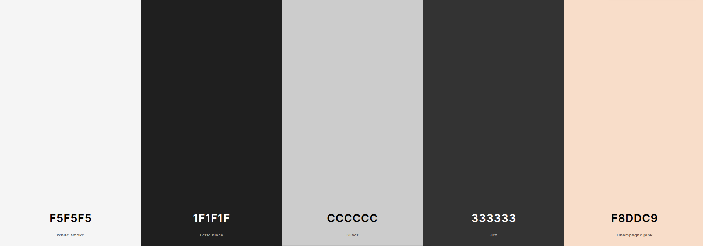

# Instalación del boilerplate, creación del repositorio y guía de estilo

Al igual que en la PEC1, el primer paso que se llevó a cabo en la realización de esta PEC fue la instalación de [UOC boilerplate](https://github.com/uoc-advanced-html-css/uoc-boilerplate). 

Se creó un nuevo repositorio git local y lo vinculé a un repositorio remoto asociado a mi cuenta de Github. Este se puede consultar a través de la siguiente URL:

[https://github.com/nacaru-w/h-II-P2](https://github.com/nacaru-w/h-II-P2)

Esto permitiría tener un sistema de control de cambios, pudiendo revertir a un estado anterior en caso de necesitarlo. La habilitación de un repositorio público es necesaria para la publicación de la página a través de Netlify.

A continuación, instalé las dependencias del boilerplate a través de `npm` mediante el comando de terminal `npm install`. Después, se instaló Stylelint mediante el siguiente comando:

```bash
npm install --save-dev stylelint stylelint-config-standard-scss
```

Se añadió, por cuestiones de hábito, un script para el comando `npm run start`, que realiza las mismas funciones que `npm run dev` en el archivo `package.json`.

Se creó el archivo `.stylelintrc.json`, con la configuración adaptada a los criterios de la guía de estilo, descritos en el siguiente párrafo y en la siguiente sección.

Como guía de estilo principal, tanto para HTML y CSS, se decidió utilizar la guía de [https://codeguide.co/](https://codeguide.co/). Se utilizó esta guía de estilo teniendo en cuenta que incluye directrices para el código HTML y CSS y que estas no entran mucho en profundidad. Se hizo de esta forma teniendo en cuenta que el tamaño de la tarea para la PEC 1 no es lo suficientemente voluminoso como para requerir la aplicación de una guía de estilo más elaborada. 

Independientemente de esta guía de estilo, yo como usuario utilizo un linter de código personalizado que realiza una serie de modificaciones (cambia aspectos como el indentado, el número de saltos de línea, etc) cada vez que realizo un guardado en la aplicación VSCode. Esto puede entrar en conflicto con algunas de las reglas especificadas en la guía de estilo elegida. El linter personalizado que uso llevo aplicándolo durante años, así que decidí dar prioridad a las modificaciones realizadas por este ante las recomendaciones de codeguide.co.

Se llevó a cabo una revisión de las normas que se podrían agregar a .stylelintrc.json para cumplir con los criterios establecidos.

Inicialmente, se estudiaron y memorizaron los criterios, y se realizaron evaluaciones periódicas para verificar su cumplimiento. Además, se corrigieron los errores reportados por Stylelint durante la compilación para producción utilizando el comando npm run start.

## Configuración de `stylelint` y configuración de las reglas: ejecución pŕactica de criterios

Se modificó el archivo de configuración de Stylelint en `.stylelintrc.json`. Por defecto, se aplican las reglas especificadas en la configuración estándar SCSS de Stylelint ([accesible aquí](https://github.com/stylelint-scss/stylelint-config-standard-scss/blob/main/index.js)). Además, con el objetivo de estandarizar el uso de unidades en el código de la hoja de estilo, se decidió añadir una regla específica que restringiese la cantidad de unidades posibles:

```json
{
    "extends": "stylelint-config-standard-scss",
    "rules": {
        "unit-allowed-list": [
            "em",
            "rem",
            "px",
            "%",
            "deg",
            "vw"
        ]
    }
}
```

Asimismo, se modificaron los scripts del archivo `package.json` para añadir la ejecución de Stylelint cara vez que se ejecute `npm run build`, de la siguiente forma:

```json
{
    "parcel:serve": "parcel src/index.html -p 8123 --target web --open",
    "parcel:build": "parcel build src/index.html --target web --no-source-maps --no-cache",
    "clean": "rimraf dist .cache .cache-loader .parcel-cache",
    "dev": "npm-run-all clean parcel:serve",
    "build": "npm-run-all clean stylelint parcel:build",
    "test": "echo 'Everything is working as expected \nStart working on your project by running \\033[1mnpm run dev\\033[0m'",
    "stylelint": "stylelint src/**/*.scss"
  }
```

También se añadió una regla que tiene como objetivo estandarizar el nombre de las clases. Esto se hizo a través de una regla que permite especificar el patrón de los selectores de clase de Stylelint con la especificación de una expresión regular como valor:

```json
"selector-class-pattern": "^[a-z0-9]+(-[a-z0-9]+)*$"
```

Asimismo, se añadió una regla para obligar a los desarrolladores a utilizar comilllas dobles ( "" ) en lugar de comillas simples ( '' ) en la denotación de los `string` del proyecto. Esto también se realizó a través de la adición de una regla de Stylelint:

```json
"string-quotes": "double"
```

En la ejecución del comando `stylint` aparece un mensaje que avisa de que la regla se encuentra obsoleta (_deprecated_), pero para los objetivos de esta práctica, después de una revisión de su funcionamiento, se decidió mantener.

Algo que se realizó también fue la adición de la obligación de aplicar la notación moderna en la especificación de colores. Esto se realizó mediante la introducción de la siguiente línea de código:

```json
"color-function-notation": "modern"
```

Como excepción se introdujo la eliminación de la regla `no-descending-specificity`, que se aplica por defecto en la configuración estándar `stylelint-config-standard-scss`. Esto se hizo porque daba falsos errores al no identificar correctamente la especificidad de los elemetos debido al `nesting` de SCSS. Lo recomienda la documentación de la siguiente forma en proyectos que usan mucho _nesting_:

>This rule enforces that practice as best it can, reporting fewer errors than it should. It cannot catch every actual overriding selector, but it can catch certain common mistakes. We recommend turning this rule off if you use a lot of nesting.

Las recomendaciones de _nesting_ aplicadas fueron las descritas en el apartado «[Nesting in Sass and Less](https://markdotto.com/2015/07/20/css-nesting/)» de la guía de estilo utilizada.

También se desactivó la regla estándar `comment-no-emptyp` que forma parte del conjunto de reglas `stylelint-config-standard-scss`. Esta regla emite errores cuando, en la compilación, encuentra que existen comentarios `//` que no son seguidos de ningún carácter. Para poder jerarquizar los comentarios conforme a las pautas de la guía de estilo de codeguide.co, los comentarios que se construyen como títulos de secciones se disponen englobados de este tipo, razón por la que se añadió esta excepción. Esto se hizo igualmente a través de una modificación en el archivo `.stylelintrc.json` de la siguiente forma:

```json
"scss/comment-no-empty": null
```

## Instalación de bootstrap

Se integró Bootstrap en el repositorio local, ejecutando el siguiente comando:

```bash
npm i --save bootstrap @popperjs/core
```


## Justificación y aplicación según la guía de estilo


## Elección de la paleta de colores

Para la paleta de colores, se testearon varias combinaciones utilizando al aplicacion [coolors.co](coolors.co). Finalmente, se decidió usar la siguiente paleta de colores:

{ width=400px }

* El color #F5F5F5 (whitesmoke) se asignó a los fondos básicos
* El color #1f1f1f (eerie black) se asignó al color de los textos
* El color #cccccc (silver) se asignó a
* El color #333333 (jet) se asignó a
* El color #f8ddc9 (champagne pink) se asignó a elementos de contraste, creándose una tonalidad más oscura mediante el módulo SCSS `@color`, la cual se aplicó a los enlaces a través de la pseudoclase `hover`.

Estos colores fueron asignados a variables SCSS en el archivo `_variables.scss`.

También se han usado ocasionalmente algunos de los [colores propuestos en Bootstrap](https://getbootstrap.com/docs/5.3/customize/color/), cuando se ha considerado que estos encajaban bien con la paleta de colores elegida y el contexto. 

## Iconografía e imágenes

Para los iconos de la web, decidió usarse el paquete de Sports por ainul muttaqin en The Noun Project (disponible [en este enlace](https://thenounproject.com/browse/collection-icon/sports-118176/?p=1)), liberados bajo licencia CC BY 3.0.

Para las imágenes de los miembros del club se usó la página Generated.Photos. Estas se modificaron a través de la propiedad `clip-path` con el valor `circle(50% at 50% 50%)`. Se utilizó la herramienta [clippy](https://bennettfeely.com/clippy/) para ello.

# Elaboración de la página web

## Desarrollo de encabezado y pie

### Desarrollo del `header`
Para el header se decidió utilizar HTML y SCSS puro. Se siguió un diseño basado en los _wireframes_ proporcionados en el enunciado de la práctica, con una barra superior en la que se mostrara, a la izquierda, el logo principal del club, y, a la derecha, el menú de navegación con las diferentes páginas que conforman el sitio web. 

Para el código HTML, se utilizó el elemento `header` para englobal todo el contenido. Este contiene un `div` con la clase `container` para poder modificar fácilmente los elementos de dentro. Estos son tres, el logo principal de la página, configurado como un enlace que lleva a la página principal; el botón que abre el menú de navegación _responsive_ (desarrollado en los párrafos posteriores), configurado como un elemento `button`; y el menú de navegación en sí, configurado como un elemento `nav`. 

En cuanto al código SCSS, estos elementos fueron distribuidos fácilmente a través de la propiedad `display: flex` y situados adecuadamente mediante `align-items:center` y `justify-content: space between`. Sin embargo, se decidió, desde un enfoque orientado hacie una mayor _responsiveness_, crear un menú _responsive_ para cuando el tamaño de pantalla dispositivo fuera menor.

{ width=200px }

Para su funcionamiento, se añadió una amplia `@media` _query_ que se aplicaría en dispositivos de anchura menor a `40em`. En estos casos, aparecería una imagen de «hamburguesa» en la esquina superior derecha de la pantalla (configurada a través de CSS como un fondo). Esta imagen, ligada a un _event listener_ de javascript que aplica una clase `data-visible`, ligada a un código css `display:block` o `display:none` a través de un _toggle_, abriría un menú configurado a través de `display: grid`, que mostraría las opciones de navegación. Para conseguir el efecto de sombreado que se aplica al resto de elementos de la página, se añadió un borde expandido a `1000vh` con una opacidad del 50% a través de la propiedad `box-shadow`. Para que el menú no tuviese colisión con el resto de elementos de la página, se le añadió al propiedad CSS `position: fixed`. Además, para que este apareciese en una posición (en cuanto a profundidad) más prioritaria respecto al resto de elementos, se aplicó la propiedad `z-index: 950`. Se usó la propiedad `gap` para configurar la distancia entre los elementos de la lista que conforma el menú.

### Desarrollo del `footer`
Para el desarrollo del _footer_, se siguió, de igual forma, la distribución proporcionada por los _wireframes_ del enunciado de la práctica. Sin embargo, para esta sección estos no eran demasiado específicos, por lo que se decidió seguir un enfoque propio en su diseño y elaboración.

De esta forma, se creó un _footer_ dividido en dos secciones. Una sección superior, determinada mediante un elemento `div` con clase `main-footer`, y una interior, determinada con un elemento `div` con clase `sub-footer`. El `main-footer` contiene, a su vez, dos elementos `div`: uno `left-side-footer` y otro `right-side-footer`. En el espacio izquierdo de este footer se halla un botón que lleva a la página de contacto e información sobre una posible aplicación para el club, configurados como elementos `button` y `div`, respectivamente. En el otro lado, se halla información relativa a la dirección, configurada dentro de una lista no ordenada. El `sub-footer` contiene tres secciones, distribuidas en elementos `div`. De izquierda a derecha, estas corresponden al logo principal de la página, una sección de enlaces a las diferentes paǵinas de la web, conformadas como una lista no ordenada, y enlaces a redes sociales a través de iconos `svg`.

## Desarrollo del `main`: parte principal de las páginas

### Desarrollo del `main` de `index.html`

<!-- Falta documentar el resto de la realización de la portada principal -->

#### Uso de `@supports`


Con el objetivo de adaptar la hoja de estilos a navegadores que no soportan CSS grid, se hizo uso de la _query_ `@supports`. Esta permite implementar código solo en las instancias en las que el navegador posea soporte para esa característica.

En este caso, se utilizaron dos _queries_ distintas: una `@supports (display: grid)`, para dispositivos que sí soportan este rasgo; y una `@supports not (display:grid)`, que cubre los casos en los que esta característica no es implementable. Se testeó el código para comprobar que la visualización, aún siendo significativamente más sencilla, era la adecuada en estos dispositivos.

# Publicación del sitio web


# Propiededad intelectual: atribución

* Las imágenes de los miembros del club halladas en el archivo `members.html` han sido generadas por IA a través de la página Generated.Photos. Estas se encuentran en dominio público.[^1]

[^1]: La falta de elegibilidad de las imágenes generadas por inteligencia artificial para la protección de derechos de autor se debe a la ausencia de autoría humana. Aunque los algoritmos utilizados para generar estas imágenes son el resultado de la creatividad y el esfuerzo intelectual humano, la imagen resultante en sí misma es considerada por expertos como carente de originalidad humana y, por lo tanto, no cumpliría los requisitos para la protección de derechos de autor. Esta situación podría cambiar dependiendo del sentido de la jurisprudencia, pero al no existirla, se interpreta que tal protección no existe.